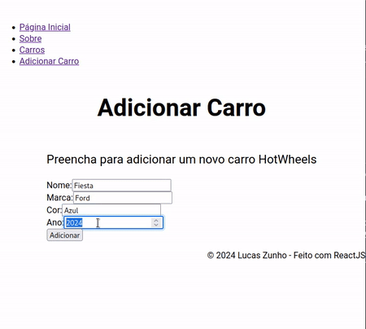

# HotWheels CRUD

Sistema *front-end* com operações CRUD (*Create*, *Read*, *Update* e *Delete*) para gerenciamento de coleções de carros *HotWheels* feito em ReactJS.

> Este é um projeto feito para a disciplina de Desenvolvimento de Sistemas Frontend com a finalidade de especializar conhecimento de *frameworks* especificos para tal. Para este projeto foi definido o uso do *Framework* ReactJS com instruções específicas de gestão de dados.

Demonstração do sistema ao ser executado:



## Execução do Projeto

Para executar o projeto siga os seguintes passos na raíz do projeto.

1. Instale as dependências do projeto:

```sh
npm install
```

2. Inicie a execução do projeto (inicialização com react):

```sh
npm start
```

## Componentes

Os componentes do projeto estão no diretório `./src/components`, quais são:

- **Componente "NavBar":** Este componente retorna os links de acesso aos recursos do sistema (os componentes principais, objetivamente).
    - **Props:**
        - *"navigate"* - Função armazenada para troca da página a ser exibida.
    > Ele apresenta uma lista de links que, conforme o sistema de roteamento, utiliza o método `navigate` para realizar a alteração de página dentro da tag `main` do App.
- **Componente "CarForm":** Retorna o formulário de adição de carros, que, com o seu envio, concatena as informações no array de carros do sistema (local).
    - **Props:**
        - *"navigate"* - Função armazenada para troca da página a ser exibida.
        - *"listCarros"* - State com forma tri-dimensional para representação de todos os carros registrados no sistema.
        - *"setListCarros"* - Método definidor do listCarros.
        - *"isSub"* (padrão: 'false') - Armazena se o formulário deve ou não fazer um registro único.
    > Este componente tem duas opções de apresentação, uma utilizada ao acessar o componente diretamente (pelo *NavBar*) e outra, ao acessar com o parâmetro `isSub`, que permite apenas uma submissão do formulário (caráter de *Popup*).
- **Componente "CarsList":** Retorna a lista dos carros armazenados pelo sistema (local). Permite o acesso aos dados detalhados (componente `CarDetail`) de cada carro do array e a exclusão de carros.
    - **Props:**
        - *"navigate"* - Função armazenada para troca da página a ser exibida.
        - *"listCarros"* - State com forma tri-dimensional para representação de todos os carros registrados no sistema.
        - *"setListCarros"* - Método definidor do listCarros.
- **Componente "CarDetail":** Retorna uma lista das informações do veículo passado por parâmetro específico (seu `ID`). São apresentadas todas as informações armazenadas pelo componente *CarForm*.
    - **Props:**
        - *"carroIdx"* - Índice do carro a ser visualizado dentro do State *listCarros*.
        - *"navigate"* - Função armazenada para troca da página a ser exibida.
        - *"listCarros"* - State com forma tri-dimensional para representação de todos os carros registrados no sistema.
        - *"setListCarros"* - Método definidor do listCarros.
- **Componente "Home":** Retorna a página inicial de apresentação do sistema.
- **Componente "About":** Retorna uma página informativa sobre o sistema com descrições complementares.
- **Componente "NotFound":** Retorna uma página "tampão" para informar que a requisição feita não é válida.
