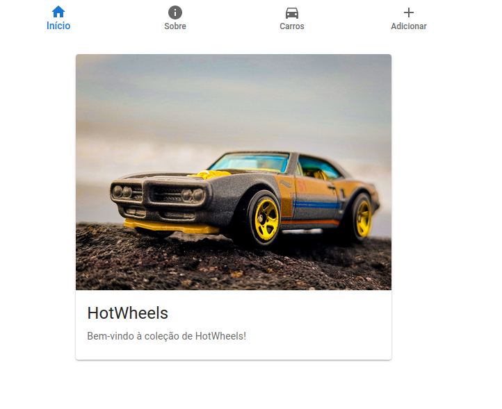

# HotWheels CRUD

Sistema *front-end* com operações CRUD (*Create*, *Read*, *Update* e *Delete*) para gerenciamento de coleções de carros *HotWheels* feito em ReactJS.

> Este é um projeto feito para a disciplina de Desenvolvimento de Sistemas Frontend com a finalidade de especializar conhecimento de *frameworks* especificos para tal. Para este projeto foi definido o uso do *Framework* ReactJS com instruções específicas de gestão de dados.

Demonstração do sistema ao ser executado:



## Execução do Projeto

Para executar o projeto siga os seguintes passos na raíz do projeto.

1. Instale as dependências do projeto:

```sh
npm install
```

2. Inicie a execução do projeto (inicialização com react):

```sh
npm start
```

## Testes

Para a realização de testes neste projeto foi utilizado o `cypress`. Para executar os specs do cypress do projeto basta executar o seguinte comando:

```sh
npm run e2e:firefox # caso utilize o browser firefox ou variantes
npm run e2e:chrome  # caso utilize o Google Chrome ou variantes
```

## Componentes

Os componentes do projeto estão no diretório `./src/components` e são estilizados com o framework frontend `Material UI`. Os componentes são:

- **Componente "NavBar":** Este componente retorna os links de acesso aos recursos do sistema (os componentes principais, objetivamente). Aqui é utilizado uma série de componentes `BottomNavigationAction` em uma instância do componente `ButtonNavigation` para a representação e estilização própria dos botões de navegação.
    > Ele apresenta uma lista de links que, conforme o sistema de roteamento, utiliza o estado `navigate` (useNavigate do `react-router-dom`) para realizar a alteração de página.
- **Componente "CarForm":** Retorna o formulário de adição de carros, que, com o seu envio, concatena as informações no array de carros do sistema (local) e realiza uma requisição POST para a API para atualização global dos dados.
    > Ao realizar a requisição o componente `Dialog` é utilizado para alertar a completude da requisição
- **Componente "CarsList":** Retorna a lista dos carros armazenados pelo sistema (API). Permite o acesso aos dados detalhados (componente `CarDetail`) de cada carro da lista apresentada e a exclusão de carros a partir de um icone de lixeira.
- **Componente "CarDetail":** Retorna um formulário com todas as informações armazenadas (utiliza-se método GET para busca na API) e possibilita a edição dos campos através de um botão "toggle", que abre para edição os campos e mostra um botão de `submit` do formulário.
- **Componente "Home":** Retorna a página inicial de apresentação do sistema com uma imagem de representação do sistema.
- **Componente "About":** Retorna uma página informativa sobre o sistema com descrições complementares.
- **Componente "NotFound":** Retorna uma página "tampão" para informar que a requisição feita não é válida.
